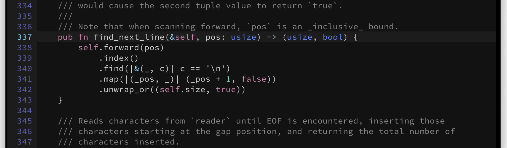
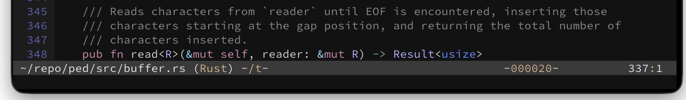
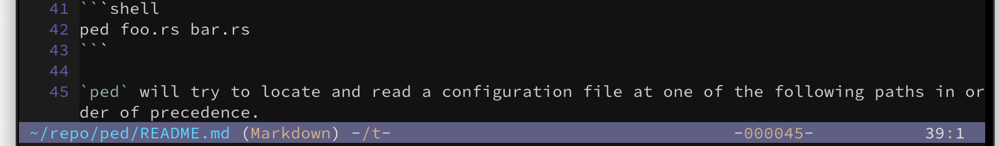

# ped

The *ped*estrian text editor.


## Background

The genesis of this project stemmed from a desire to learn the [Rust](https://www.rust-lang.org/) programming language while also building something useful and nontrivial.

This is a hobbyist project with the goal of building a fully functional terminal-based editor supporting multiple buffers and windows, regular expression search, syntax highlighting, and perhaps other features yet to be decided. I plan to develop most everything from scratch as opposed to using prebuilt libraries. The desire is to learn, not to go fast.

An [evolving narrative](DESIGN.md) of the editor explores many of the design choices in greater detail.

## Install

### Install from Homebrew

```shell
brew tap davidledwards/ped
brew install ped
```

### Install from GitHub

Releases can be downloaded directly from [GitHub](https://github.com/davidledwards/ped/releases).

## Usage

Run `ped --help` (or `ped -h`) to print a description of all available options.

Edit a file.

```shell
ped foo.rs
```

Edit multiple files, opened in separate windows.

```shell
ped foo.rs bar.rs
```

Edit a file and position the cursor at line `327` and column `14`.

```shell
ped foo.rs --goto 327,14
```

`ped` will try to locate and read a configuration file at one of the following paths in order of precedence.

- `$HOME/.pedrc`
- `$HOME/.ped/pedrc`
- `$HOME/.config/ped/pedrc`

Alternatively, a configuration file can be specified on the command line using the `--config` (or `-C`) option.

```shell
ped --config ~/alt/.pedrc README.md
```

See [.pedrc](content/.pedrc) for a detailed explanation of configuration settings. In the absence of a configuration file, `ped` will rely on default values.

`ped` will also try to locate syntax configuration files in one of the following directories in order of precedence. See the [ped-syntax](https://github.com/davidledwards/ped-syntax) repository for more information about creating and installing syntax files.

- `$HOME/.ped/syntax`
- `$HOME/.config/ped/syntax`

Alternatively, a directory containing syntax configurations can be specified using the `--syntax` (or `-S`) option.

```shell
ped --syntax ~/alt/syntax README.md
```

Prints the available syntax configurations located by `ped`.

```shell
ped --syntaxes
```

`ped` can also be instructed to ignore all configuration files, including syntax configurations, using the `--bare` (or `-b`) and `--bare-syntax` (or `-B`) options, respectively. This is useful in circumstances where configuration files contain errors, which will cause `ped` to exit prematurely.

This ignores _all_ configurations.

```shell
ped --bare README.md
```

This ignores syntax configurations only. Note that the configuration file is still loaded.

```shell
ped --bare-syntax README.md
```

## Keys

The editor comes prebuilt with a default set of opinionated key bindings. Until the project reaches version `1.0`, these builtin key bindings may change.

These key bindings can be enumerated from the CLI, the output of which may be included in a configuration file under the `[bindings]` section. See [.pedrc](content/.pedrc) for more details on modifying key bindings.

Prints the key bindings.

```shell
ped --bindings
```

Note that the prior command also reflects any modifications from a configuration file. This alternative command will print default bindings only.

```shell
ped --bare --bindings
```

Prints a list of available keys that can be used in constructing key sequences.

```shell
ped --keys
```

Prints a list of available operations that to which keys can be bound.

```shell
ped --ops
```

Prints a brief description of the `undo` operation.

```shell
ped --describe undo
```

While running `ped`, typing `C-h` will show general help information that also contains a list of all key bindings. In other words, the same content as `ped --bindings`.

## Colors

The color mechanism in `ped` adheres to the [ANSI 8-bit color standard](https://en.wikipedia.org/wiki/ANSI_escape_code#8-bit). Where applicable in configuration files, colors can always be referred to by their numeric value in the range of `0` to `255`.

However, in order to make configuration a bit more friendly, `ped` defines a set of builtin names for standard colors in the range of `0` to `15`, as well as a few creatively named colors in the extended range of `16` to `255`. The extended colors are likely to evolve over time, but there is no intention of producing an exhaustive list of names.

Prints a list of color names.

```shell
ped --colors
```

Note that the prior command also shows any color additions or modifications from a configuration file. The following command only prints builtin colors.

```shell
ped --bare --colors
```

Prints the current color theme settings, the output of which can be included in a configuration file under the `[theme]` section.

```shell
ped --theme
```

Since the prior command reflects any theme modifications from a configuration file, the following shows only the default theme settings.

```shell
ped --bare --theme
```

In the course of experimenting with different color combinations, I decided to write a CLI program [tcolor](https://github.com/davidledwards/tcolor) that shows what colors look like on the terminal. The program is quite simple but also effective in visually colors.

## Interface

By default, `ped` will display line numbers in the left margin. This feature can be disabled by specifiying the `--no-lines` option or setting `lines = false` in the configuration file. It will also highlight the cursor row unless `--no-spotlight` is specified or `spotlight = false` is defined. If the line number exceeds `99999`, then only the lower order three digits are displayed along with `--` as a prefix. For example, the line number `218375` is displayed as `--375`.

This is an example of the default configuration.



The banner bar for each open window shows the source of the content, which is usually a file path. However, the source can also be an ephemeral buffer (prefixed by `@`). A well-known ephemeral buffer, called `@scratch`, is always present and can never be closed. Other common uses of ephemeral buffers show help content, such as `@help` when `C-h` is pressed.

The source is followed by a syntax name enclosed in `(` and `)`. The name `Text` is used when no syntax definition exists. There is no highlighting for `Text` content.

To the right of the syntax name is an area that shows certain editor settings surrounded by a single `-` on both edges. The first character indicates how _end-of-line_ characters are written to storage: `/` means that `\n` (LF) is written, and `\` means that `\r\n` (CRLF) is written. The second character indicates the _tab_ mode: `t` means _soft_ tabs are enabled, and `T` means _hard_ tabs. By default, these settings are `/` and `t`, but can be changed globally on the command line or via configuration, or changed on a per-buffer basis.

To right of the editor settings in the area justified towards the right margin and surrounded by `-` is the hexidecimal value of the Unicode code point under the cursor. If the cursor is at EOF, then `000000` is displayed.

Finally, on the edge of the right margin is the line and column number under the cursor. If the line number or column number is larger than `9999999`, then all dashes are displayed, respectively.

The example below shows the file `~/repo/ped/src/buffer.rs` being edited with `Rust` syntax highlighting enabled, _eol_ mode set to LF, _tab_ mode set to _soft_, the code point under the cursor as a space (`0x20`), and the cursor at line `337`, column `1`.



When a buffer has unsaved modifications, the color of the _source_ changes.



## Limitations

`ped` currently has a few notable limitations or deficiencies that may be addressed in future versions.

- An auto-save feature has not been implemented, so remember to save frequently.
- TAB characters `\t` are not indented as one might expect, but rather shown as the special character `→`.
- Control characters other than `\t` and `\n` are shown as `¿`, though one can place the cursor under such characters and press `C-t` to see the Unicode code point.
- A target binary does not exist for Windows.

## Contributing

Please refer to the [contribution guidelines](CONTRIBUTING.md) when reporting bugs and suggesting improvements.

## License

Copyright 2024 David Edwards

Licensed under the Apache License, Version 2.0 (the "License"); you may not use this file except in compliance with the License. You may obtain a copy of the License at

<http://www.apache.org/licenses/LICENSE-2.0>

Unless required by applicable law or agreed to in writing, software distributed under the License is distributed on an "AS IS" BASIS, WITHOUT WARRANTIES OR CONDITIONS OF ANY KIND, either express or implied. See the License for the specific language governing permissions and limitations under the License.
